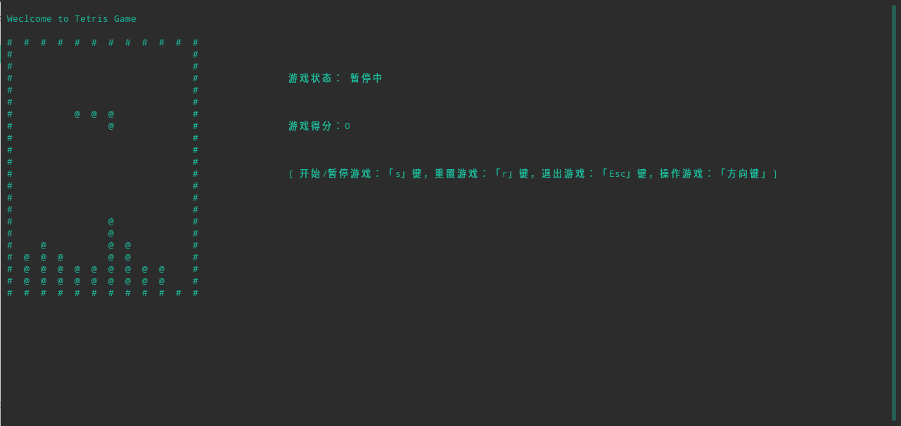

# 用 Go 语言实现俄罗斯方块

**可通过如下获取：**
```
go get -v github.com/G-lwen/small-game
```

**运行游戏：**
打开终端，在当前目录下输入
```
$ go run *.go
```
或者
```
$ go build
$ ./tetris-go
```

**效果图：**


**参考：**

https://github.com/jjinux/gotetris